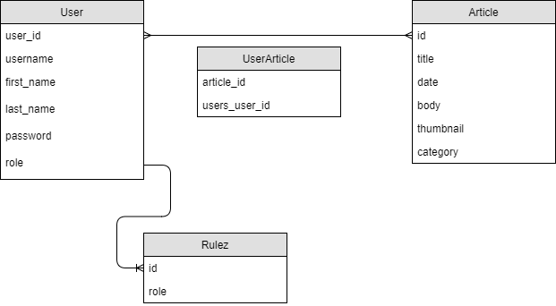

3. Hírportál

Készítsük el egy online portál hírkezelő rendszerét, ahol a munkatársak
feltölthetik cikkeiket, amelyek megjelennek egy webes felületen.

A webes felület tartalmazza magát a hírportált, ahol az olvasók tetszőlegesen
böngészhetik a híreket.

    • A főoldalon megjelennek a legfrissebb hírek (cím és összefoglaló, dátum
    szerint csökkenő sorrendben, legfeljebb 10), illetve a lap tetején kiemelten a
    vezető cikk (cím és összefoglaló) képpel (amennyiben több kép tartozik a
    cikkhez, az első jelenik meg, kicsinyített méretben).

    • A címet kiválasztva megjelenik a teljes tartalom (beleértve a szerző nevét,
    illetve a bevitel, vagy utolsó módosítás dátumát) képpel (ha van kép a cikkhez
    rendelve, amennyiben több kép tartozik a cikkhez, az első jelenik meg,
    kicsinyített méretben). A képet kiválasztva megjelenik a cikkhez tartozó
    képgyűjtemény, ahol egyenként lapozhatunk a képek között, illetve
    visszaléphetünk a cikkhez.

    • A hírportál tartalmaz egy archívumot, ahol dátum szerint csökkenő
    sorrendben listázódnak a hírek (cím és összefoglaló). Egy oldalon legfeljebb
    20 hírt láthatunk, a többiért lapozni kell. Az archívumban lehet keresni is,
    megadott dátumra, cím(részlet)re, vagy tetszőleges szóra a cikk tartalmából.
  
 A grafikus felületet tehát a portál munkatársai használják a cikkek írására, illetve
 feltöltésére.
 
    • A program használatához először be kell jelentkeznie a munkatársnak a
    felhasználónév és a jelszó megadásával. Ezt követően válnak elérhetővé a
    szerkesztési funkciók (illetve a kijelentkezés).

    • A főablakban a saját cikkek listázódnak dátum szerint (cím, író, dátum),
    amelyeket módosíthatunk, illetve törölhetünk is.

    • Új cikk felvitelénél meg kell adnunk a címet, az összefoglalót (max. 1000
    karakter), valamint a teljes szöveget. Ezek kitöltése kötelező. A cikk
    beállítható vezető cikknek, ekkor azonban kötelező legalább egy képet
    feltölteni hozzá. Ezen felül feltölthetnek tetszőleges számú képet a cikkhez.

    • Cikk módosításánál is ugyanezt a felületet kapjuk vissza, de már előre kitöltve.

    • Cikk törlésénél a program megerősítést kér a felhasználótól.
    
Az adatbázis az alábbi adatokat tárolja:

    • felhasználó (név, azonosító, jelszó);

    • cikkek (cím, szerző);
    
    • képek (cikk azonosító, kép);
    
Szakterületi fogalmak:

    • Cikk: Önálló írás egy újságban, írott sajtóban közölt írás egy témában.
    
    • Hírportál: Egy honlap, amely a nyomtatott újságot valósítja meg számítógéppel elérhető, 
                 olvasható és kinyomtatható formában.
    
    • Archívum: Írott vagy más formában rögzített adatok tárolására használt hely.
    
Szerepkörök:

    • Munkatárs: Bejelentkezés után új cikket tölthet fel, meglévőt szerkeszthet, vagy törölhet.
    
    • Olvasó: Böngészheti a meglévő cikkeket, és képeket.
    
Funkcionális követelmények:

    • regisztráció
    • bejelentkezés
    • cikkek böngészése
    • új cikk létrehozása (author jogot igényel)
    • meglévő cikk szerkesztése (author jogot igényel)
    • cikk törlése (admin jogot igényel)
    
Nem funkcionális követelmények:

    • gyorsaság
    • biztonság
    • megbízhatóság
    • könnyű kezelés
    
Fejlesztői dokumentáció:

Fejlesztői környezet:

    • NetBeans fejlesztői környezet
    • Spring MVC – Spring Boot technológia
    • Maven 
    • H2 adatbázis
    • Git, GitHub verziókövető rendszer
    
Adatbázis(terv):

Több a többhöz kapcsolat létesítése a felhasználók, és a cikkek között, továbbá minden felhasználóhoz tartozik egy szerepkör(egy a többhöz kapcsolat).
Több a többhöz kapcsolat megvalósítása egy kapcsolótáblával.

TODO: rulez tábla esetén stackoverflow bejelentkezés, és regisztrációkor...

Végpontok:

User:
    • GET /api/user
    • POST /api/user/login :  bejelentkezés
    • POST /api/user/logout :  kijelentkezés
    • POST /api/user/register : regisztráció

